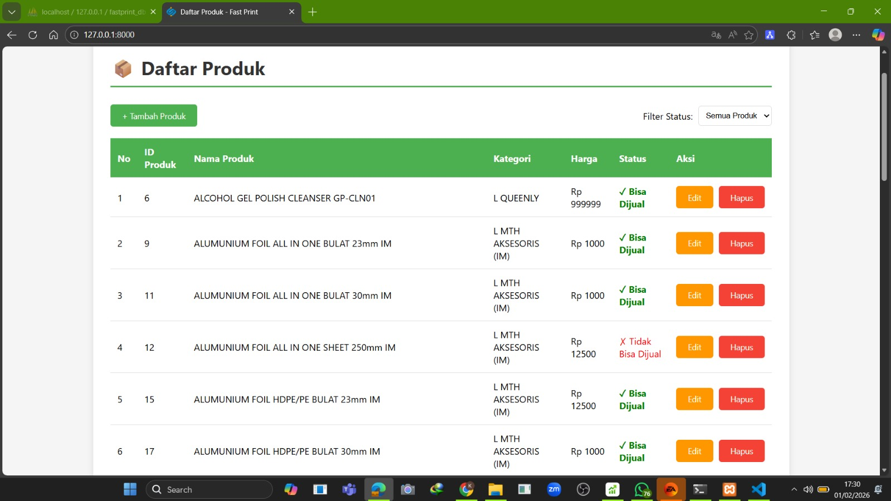
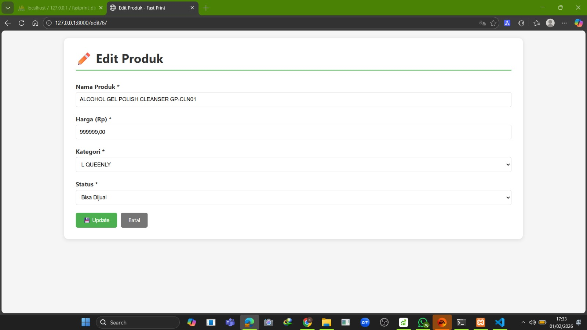
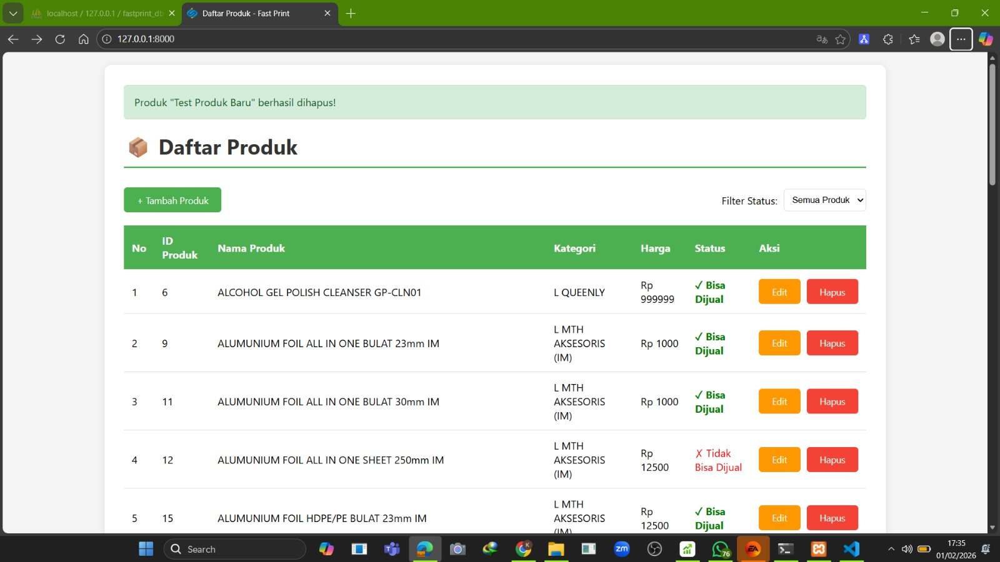

# Test Programmer - Fast Print Indonesia

Aplikasi manajemen produk untuk seleksi Junior Programmer Fast Print Indonesia cabang Surabaya.

## 📋 Informasi

- **Nama**: Kevin Aurelius Suryono
- **Posisi**: Junior Programmer
- **Framework**: Django 4.2
- **Database**: SQLite
- **Tanggal**: Februari 2026

## 🎯 Fitur

1. ✅ Mengambil data produk dari API
2. ✅ Menampilkan daftar produk
3. ✅ Filter produk berdasarkan status "bisa dijual"
4. ✅ Tambah produk baru dengan validasi
5. ✅ Edit produk existing
6. ✅ Hapus produk dengan konfirmasi
7. ✅ Form validasi (nama wajib diisi, harga harus angka)

## 🛠️ Teknologi

- **Backend**: Python 3.13, Django 4.2
- **Database**: SQLite
- **API Integration**: requests library
- **Frontend**: HTML, CSS (native, no framework)

## 📦 Instalasi

### 1. Clone Repository
```bash
git clone https://github.com/rafaede/fastprint_test.git
cd fastprint_test
```

### 2. Install Dependencies
```bash
pip install django==4.2
pip install requests
```

### 3. Setup Database
```bash
python manage.py migrate
```

### 4. Import Data dari API
```bash
python import_data.py
```

### 5. Jalankan Server
```bash
python manage.py runserver
```

### 6. Buka Browser
```
http://127.0.0.1:8000/
```

## 📂 Struktur Project
```
fastprint_test/
├── config/              # Settings Django
├── products/            # App utama
│   ├── models.py       # Model Produk, Kategori, Status
│   ├── views.py        # Logic CRUD
│   ├── urls.py         # Routing
│   └── templates/      # HTML templates
├── import_data.py      # Script import dari API
├── manage.py
└── README.md
```

## 🔑 API Credentials

- **Endpoint**: `https://recruitment.fastprint.co.id/tes/api_tes_programmer`
- **Username**: `tesprogrammer010226C17` (berubah sesuai waktu server)
- **Password**: MD5 dari `bisacoding-01-02-26`
- **Method**: POST

## 📸 Screenshots

### Daftar Produk


### Form Tambah/Edit


### Konfirmasi Hapus


## ✅ Checklist Requirements

- [x] Ambil data dari API
- [x] Buat 3 tabel (Produk, Kategori, Status)
- [x] Tampilkan daftar produk
- [x] Filter produk "bisa dijual"
- [x] Fitur tambah dengan validasi
- [x] Fitur edit dengan validasi
- [x] Fitur hapus dengan konfirmasi
- [x] Validasi: nama wajib diisi
- [x] Validasi: harga harus angka
- [x] Upload ke GitHub
- [x] Dokumentasi lengkap

## 👤 Kontak

**Kevin Aurelius Suryono**
- Email: kevinaurelius2709@gmail.com
- Phone: 087853190255
- LinkedIn: [linkedin.com/in/kevin-aurelius-649a1b293](https://linkedin.com/in/kevin-aurelius-649a1b293)
- GitHub: [github.com/rafaede](https://github.com/rafaede)
